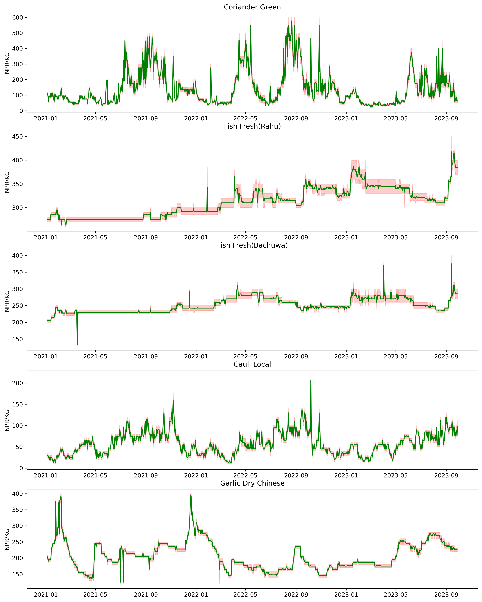

# 🥦 Kalimati Tarkari Bazaar — Vegetable Price Prediction

A data analysis and machine learning project for forecasting daily vegetable prices at the **Kalimati Fruits and Vegetables Market**, Kathmandu, Nepal. Prices are recorded in **NPR/KG** and the model produces 7-day ahead forecasts for any commodity in the dataset.
In case ,if the .ipynb file doesnot open i have uploaded the image of the code
---

## 📁 Project Structure

```
kalimati_project/
├── kalimati_historical_dataset.csv   # Raw historical price data
├── kalimati_prediction.ipynb         # Main analysis & modelling notebook
├── Top_traded_vegetables.png         # Price trend visualization
└── models/
    ├── random-forest.pkl             # Trained RandomForestRegressor
    └── label_encoder.pkl             # LabelEncoder for commodity names
```

---

## 📊 Dataset

**File:** `kalimati_historical_dataset.csv`

| Column | Description |
|---|---|
| `Vegetables` | Commodity name (e.g. `Tomato Big(Nepali)`, `Cauli Local`) |
| `Date` | Trading date (mixed format, parsed with `pd.to_datetime`) |
| `Unit` | Unit of measurement (`kg`, `Doz`, `Per Piece`, etc.) |
| `Minimum` | Minimum daily price (NPR) |
| `Maximum` | Maximum daily price (NPR) |
| `Average` | Average daily price (NPR) — **prediction target** |

- **Rows:** ~96,480
- **Unique commodities:** 133
- **Date range:** January 2021 – April 2022

---

## 🔍 Exploratory Analysis

The notebook visualises the 5 most frequently traded commodities, plotting the daily average price (green line) with a min–max band (red shaded area):

| Commodity | Observations |
|---|---|
| **Coriander Green** | High seasonal volatility, recurring price spikes |
| **Fish Fresh (Rahu)** | Steady upward trend over the period |
| **Fish Fresh (Bachuwa)** | Gradual increase with step-changes |
| **Cauli Local** | Strong seasonal cycle, sharp peaks in winter |
| **Garlic Dry Chinese** | Periodic spikes, declining mid-period |



---

## ⚙️ Feature Engineering

For each commodity the `make_features()` function constructs the following features:

**Lag features**
- `lag_1` — previous day's average price
- `lag_7` — price 7 days ago
- `lag_30` — price 30 days ago

**Rolling statistics**
- `roll_mean_7`, `roll_std_7` — 7-day rolling mean and standard deviation
- `roll_mean_30`, `roll_std_30` — 30-day rolling mean and standard deviation

**Calendar features**
- `month`, `day_of_week`, `day_of_year`

**Domain-specific flags**
- `is_dashain` — 1 if month is October/November (major festival season)
- `is_monsoon` — 1 if month is June–August

**Anomaly label**
- `anomaly_label` — rolling IQR-based spike detection (`+1` = upper spike, `-1` = lower dip, `0` = normal)

**Encoded commodity**
- `Vegetables_enc` — label-encoded commodity name

---

## 🤖 Model

**Algorithm:** `RandomForestRegressor` (scikit-learn)

| Hyperparameter | Value |
|---|---|
| `n_estimators` | 300 |
| `max_depth` | 10 |
| `random_state` | 42 |
| `n_jobs` | -1 |

**Train/test split:** 80/20, chronological (no shuffle), evaluated with **MAPE** (Mean Absolute Percentage Error).

---

## 📈 7-Day Forecasting

The `forecast_7days_direct()` function generates a rolling 7-day price forecast for any commodity:

1. Builds features from the last available row in the historical data.
2. Iteratively predicts one day at a time, updating lag features with each prediction.
3. Returns a list of 7 rounded NPR/KG values.

**Example usage:**

```python
import joblib, pandas as pd

# Load artefacts
model = joblib.load("models/random-forest.pkl")
le    = joblib.load("models/label_encoder.pkl")
df    = pd.read_csv("kalimati_historical_dataset.csv")
df.columns = ["Vegetables", "Date", "Unit", "Minimum", "Maximum", "Average"]
df["Date"] = pd.to_datetime(df["Date"], format="mixed")

# Forecast
preds = forecast_7days_direct("Tomato Big(Nepali)", df, model, le)
print("7-day forecast (NPR/KG):", preds)
```

---

## 🛠️ Dependencies

```
pandas
numpy
matplotlib
seaborn
scikit-learn
joblib
```

Install with:

```bash
pip install pandas numpy matplotlib seaborn scikit-learn joblib
```

---

## 📌 Notes

- Prices below or equal to 0 are filtered out during preprocessing.
- The `Unit` column is normalised to lowercase (`kg`, `doz`, etc.) but the model currently targets KG-based commodities.
- Festival season (`is_dashain`) and monsoon flags are hard-coded by Gregorian month; Nepali calendar alignment may improve accuracy.

---

## 🗂️ Data Source

Kalimati Fruits and Vegetables Market Development Board (KFVMDB), Kathmandu, Nepal.
